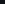

# test-cross-branch-image-links

This repo is a focused test harness for GitHub README image rendering when `main` links to assets on `develop`.

## Preconditions

- `main` is the branch whose README is rendered.
- `develop` contains `assets/inbox-02.png` and `assets/inbox-03.png`, which do not exist on `main`.
- `assets/inbox-01.png` exists on both branches and serves as a same-branch control.
- `assets/black-pixel-ish.png` exists on `main` and serves as a fallback/control image.

## What To Verify On GitHub

1. Does a README on `main` render an image whose URL explicitly names `develop`?
2. Does the result differ between Markdown syntax and raw HTML syntax?
3. Does a blob-style URL with `?raw=1` behave differently from `raw.githubusercontent.com`?
4. Does a relative path stay pinned to `main` instead of crossing to `develop`?
5. What visual failure mode appears when the image URL is broken?
6. If a passing cross-branch source is used inside `<picture>`, does GitHub honor the `<source srcset>` or fall back to the nested ``?

## Test Area

### Probe 00: Control - Markdown relative same-branch asset

Expected: should render on `main`, confirming baseline README image rendering is healthy.

### Probe 01: Markdown + raw.githubusercontent.com + develop-only asset

Expected: should render if GitHub README accepts absolute raw URLs that explicitly target `develop`.

### Probe 02: HTML img + raw.githubusercontent.com + develop-only asset

Expected: should render if GitHub preserves a plain `` tag whose `src` targets `develop`.

### Probe 03: HTML picture/source + raw.githubusercontent.com + main fallback

Expected: if GitHub keeps `<picture>` and `<source srcset>`, the develop asset should render; otherwise behavior may fall back to the nested `` on `main`.

<picture>
  <source
    srcset="https://raw.githubusercontent.com/hesreallyhim/test-cross-branch-image-links/develop/assets/inbox-02.png"
  >
  
</picture>

### Probe 04: HTML img + broken raw URL on develop

Expected: should fail visibly and reveal GitHub's broken-image behavior for an absolute cross-branch URL that does not exist.

### Probe 05: Negative control - relative path to a develop-only asset

Expected: should fail, because the relative path resolves against `main`, where `assets/inbox-02.png` does not exist.

### Probe 06: HTML img + blob URL with raw query + develop-only asset

Expected: may render, but this is intentionally a secondary probe because `raw.githubusercontent.com` is the preferred syntax.

